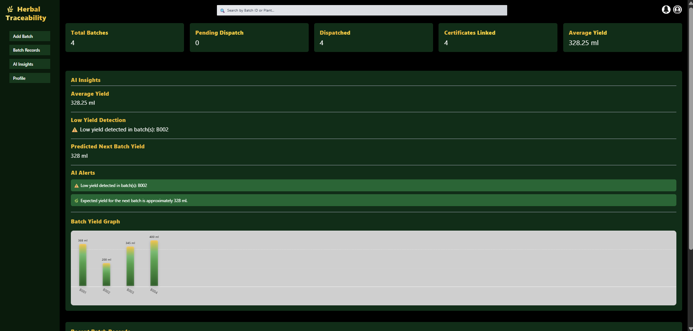
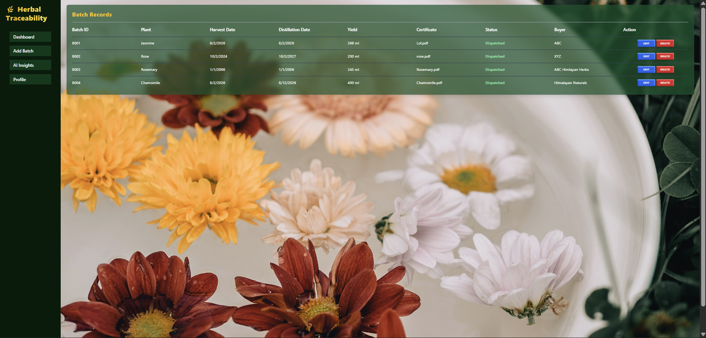
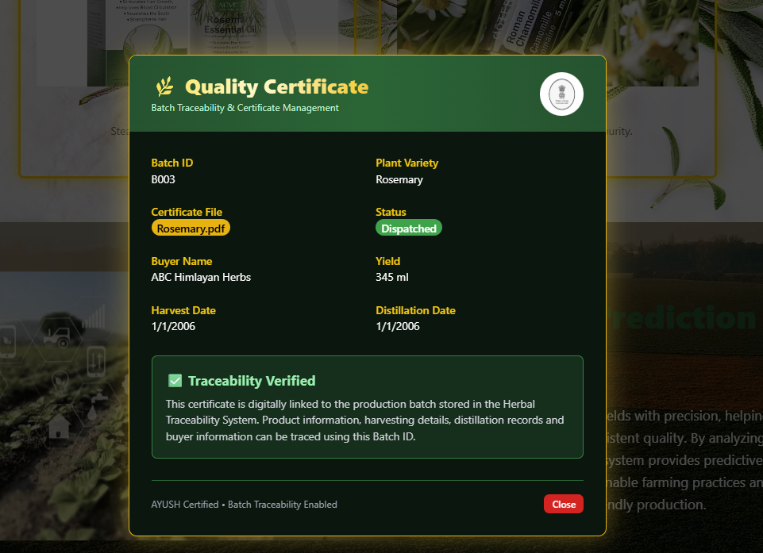
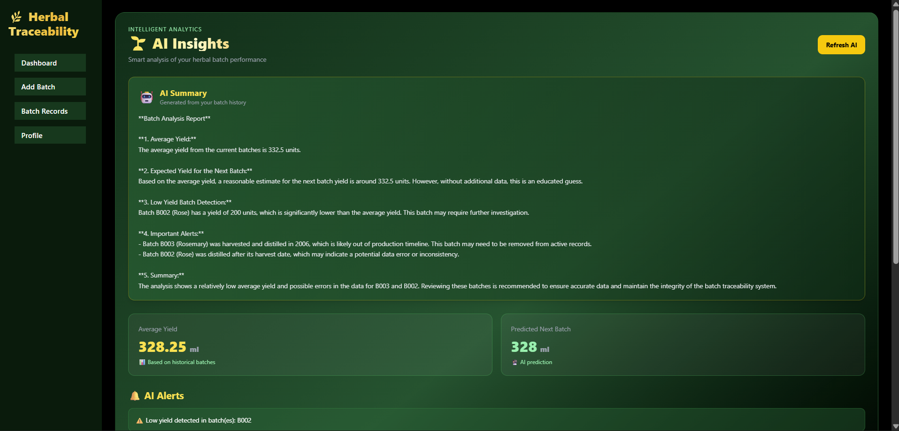

# Herbal Batch Traceability & Certificate Management System

A web-based batch traceability and certificate management system designed to improve transparency, quality assurance, and traceability in herbal and essential-oil production.

## Live Demo

**Frontend:** https://herbal-batch-traceability-certifica-six.vercel.app/

**Backend API:** https://herbal-batch-traceability-certificate.onrender.com

## Screenshots

### Dashboard

### Batch Management

### Certificate Management

### AI Feature

> Place the four screenshots inside a `screenshots` folder in the repository and update the filenames above if necessary.

Features
User registration and login
JWT-based authentication
Google OAuth authentication
User profile management
Profile image management
Batch record creation and management
Herbal batch traceability
Certificate management
Rosemary and other herbal batch information
Authentication-protected API routes
AI-assisted batch analysis and insights
AI chatbot functionality
Low-yield batch detection
Expected yield prediction based on historical batch data
AI-generated alerts and summaries
Notifications
Password reset functionality
Responsive interface for desktop and mobile devices
REST API-based frontend-backend communication
MongoDB Atlas database integration
Production deployment using Vercel and Render
Tech Stack
Frontend
React.js
Vite
Tailwind CSS
React Router
React Icons
React Hot Toast
React Toastify
Recharts
Backend
Node.js
Express.js
REST APIs
JWT Authentication
Passport.js
Google OAuth 2.0
Express Validator
Express Rate Limit
Nodemailer
Database
MongoDB
MongoDB Atlas
Mongoose
AI
Groq API
Llama 3.1 8B Instant
Groq SDK

The AI functionality is used for:

Batch yield analysis
Expected yield prediction
Low-yield batch detection
Important alerts
Dashboard summaries
Herbal AI chatbot interactions
Deployment
Vercel for frontend deployment
Render for backend deployment
MongoDB Atlas for cloud database hosting
GitHub for source-code management and version control
Setup Instructions
1. Clone the Repository
git clone https://github.com/Thecharming22/Herbal-Batch-Traceability-Certificate-Management-System.git

cd Herbal-Batch-Traceability-Certificate-Management-System
2. Install Frontend Dependencies

From the project root:

npm install
3. Install Backend Dependencies
cd backend
npm install
4. Configure Backend Environment Variables

Create a .env file inside the backend directory.

Example:

PORT=5000

MONGO_URI=your_mongodb_atlas_connection_string

JWT_SECRET=your_jwt_secret

SESSION_SECRET=your_session_secret

FRONTEND_URL=http://localhost:3000

GROQ_API_KEY=your_groq_api_key

EMAIL_USER=your_email

EMAIL_PASS=your_email_password

GOOGLE_CLIENT_ID=your_google_client_id

GOOGLE_CLIENT_SECRET=your_google_client_secret

GOOGLE_CALLBACK_URL=http://localhost:5000/api/auth/google/callback

Never commit the .env file to GitHub.

5. Configure Frontend Environment Variables

Create a .env file in the frontend/root directory:

VITE_API_URL=http://localhost:5000

For production:

VITE_API_URL=https://herbal-batch-traceability-certificate.onrender.com
6. Start the Backend

From the backend directory:

npm start

The backend runs locally on:

http://localhost:5000
7. Start the Frontend

From the project root:

npm run dev

The Vite development server runs on:

http://localhost:3000
8. Build the Frontend
npm run build

The production build is generated in the dist directory.

API Documentation

The application uses REST APIs built with Express.js.

Base URL
Local
http://localhost:5000
Production
https://herbal-batch-traceability-certificate.onrender.com
Authentication APIs

Authentication routes are available under:

/api/auth

The application uses JWT-based authentication for protected requests.

Google OAuth is also supported through Passport.js.

User APIs

Base route:

/api/users

Supported operations include:

GET    /api/users
GET    /api/users/:id
PUT    /api/users/:id
DELETE /api/users/:id
GET    /api/users/search/:name
PUT    /api/users/profile-image

Protected routes require authentication.

Batch APIs

Base route:

/api/batches

Batch records are stored in MongoDB Atlas.

Example certificate endpoint:

GET /api/batches/certificate/rosemary

Authenticated requests use:

Authorization: Bearer <token>
AI Insights API

Base route:

/api/ai

AI insights endpoint:

POST /api/ai/insights

The endpoint:

Fetches historical batch records from MongoDB.
Calculates average yield.
Predicts the expected yield.
Detects batches with unusually low yield.
Generates alerts.
Sends the batch information to the Groq LLM.
Returns an AI-generated analysis.

The AI uses:

Groq API
Llama 3.1 8B Instant
Chatbot API

Base route:

/api/chat

Example request:

POST /api/chat
Content-Type: application/json

Request body:

{
  "message": "Provide information about herbal batch traceability."
}

The frontend sends chatbot messages using:

`${import.meta.env.VITE_API_URL}/api/chat`

The backend processes the request using the configured AI service.

Notification APIs

Base route:

/api/notifications

Used for application notification functionality.

Password Reset

Password reset functionality is handled through the authentication API.

Example:

/api/auth/reset-password/:token
Google OAuth

Google authentication uses:

/api/auth/google/callback
AI Feature

The application includes an AI-assisted analytics system called Herbal AI.

Historical batch records are retrieved from MongoDB and converted into structured data containing information such as:

Batch ID
Plant variety
Yield
Harvest date
Distillation date
Batch status

The system calculates the historical average yield and identifies batches whose yield is significantly below the average.

The processed information is then provided to the Groq LLM.

AI Model
Llama 3.1 8B Instant
AI Provider
Groq API
AI Use Cases
Historical batch analysis
Expected yield prediction
Low-yield detection
Production alerts
Short dashboard summaries
Herbal production chatbot
Architecture / Folder Structure

The project follows a separate frontend and backend architecture.

Herbal-Batch-Traceability-Certificate-Management-System/
│
├── src/
│   ├── components/
│   │   ├── ChatBot.jsx
│   │   ├── ProductShowcase.jsx
│   │   └── ...
│   │
│   ├── pages/
│   │   ├── Login.jsx
│   │   ├── SignUp.jsx
│   │   ├── Dashboard.jsx
│   │   ├── AddBatch.jsx
│   │   ├── Profile.jsx
│   │   ├── ForgotPassword.jsx
│   │   ├── ResetPassword.jsx
│   │   └── ...
│   │
│   ├── App.jsx
│   └── main.jsx
│
├── backend/
│   ├── config/
│   │   └── passport.js
│   │
│   ├── middleware/
│   │   ├── auth.js
│   │   └── errorHandler.js
│   │
│   ├── models/
│   │   ├── Batch.js
│   │   ├── Notification.js
│   │   └── User.js
│   │
│   ├── routes/
│   │   ├── auth.js
│   │   ├── users.js
│   │   ├── batches.js
│   │   ├── notificationRoutes.js
│   │   ├── chat.js
│   │   └── ai.js
│   │
│   ├── server.js
│   └── package.json
│
├── public/
├── screenshots/
├── package.json
├── vite.config.js
├── .gitignore
└── README.md
Application Flow
React + Vite Frontend
        │
        │ REST API Requests
        ▼
Express.js Backend
        │
        ├── JWT Authentication
        ├── Google OAuth
        ├── User Management
        ├── Batch Management
        ├── Certificate Management
        ├── Notifications
        └── AI / Chatbot
                │
                ▼
           Groq API
                │
                ▼
         Llama 3.1 8B
        │
        ▼
    MongoDB Atlas

The frontend is deployed on Vercel, while the backend is deployed on Render. MongoDB Atlas provides the cloud database layer.

Known Limitations
The backend uses the Render free tier, so the service may take some time to respond after a period of inactivity.
AI functionality depends on Groq API availability and usage limits.
Google OAuth depends on correctly configured Google OAuth credentials.
Email-based password reset requires correctly configured email credentials.
The production application requires an active internet connection.
Some advanced production features may require infrastructure beyond the free-tier services.
Credits & Acknowledgements

This project was developed as part of the TBI-GEU Internship Program 2026.

Technologies and Services
React.js and Vite for frontend development
Tailwind CSS for styling
Node.js and Express.js for backend development
MongoDB Atlas for database hosting
Groq API and Llama 3.1 8B Instant for AI functionality
Vercel for frontend deployment
Render for backend deployment
Git and GitHub for version control

AI-assisted development tools were used during development for debugging, implementation guidance, API integration assistance, and problem solving.

Deployment
Frontend
https://herbal-batch-traceability-certifica-six.vercel.app/
Backend
https://herbal-batch-traceability-certificate.onrender.com
GitHub Repository
https://github.com/Thecharming22/Herbal-Batch-Traceability-Certificate-Management-System

The frontend communicates with the production backend through:

VITE_API_URL=https://herbal-batch-traceability-certificate.onrender.com
Project Status

The application is deployed and accessible through the production frontend and backend URLs.

The backend is connected to MongoDB Atlas and the AI functionality is integrated using the Groq API.